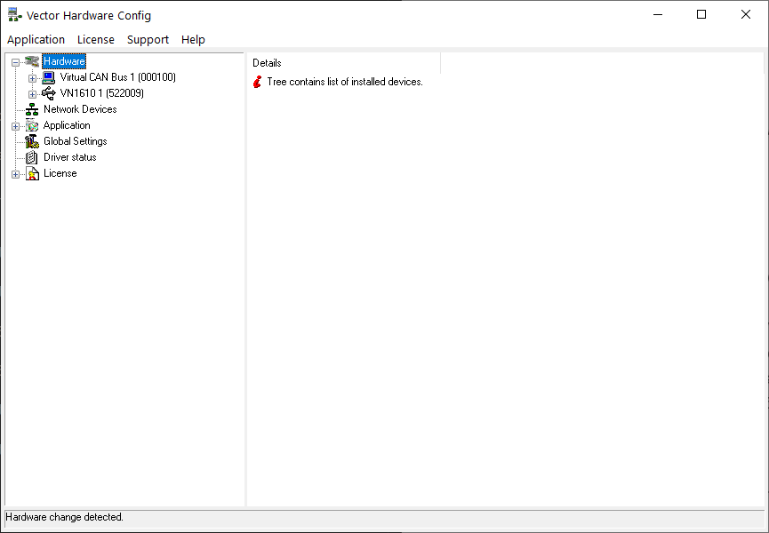
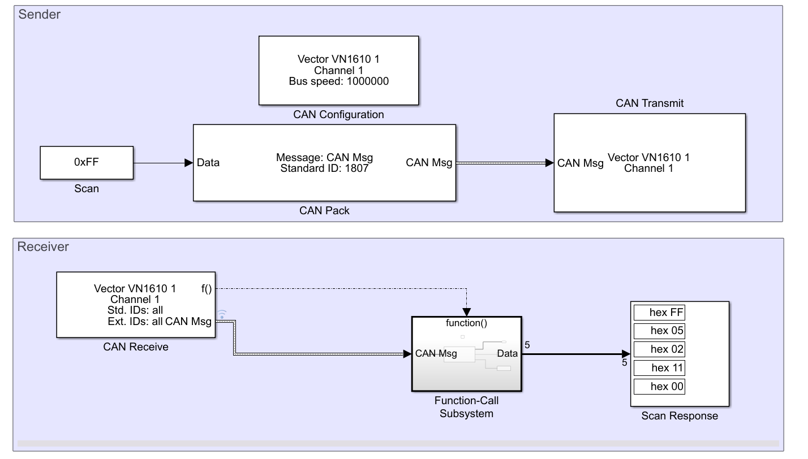

Vector VN1610 Transceiver Setup
=====
The aim of this document is to collect all the necessary steps to configure the Vector VN1610 Transceiver for use with MATLAB/Simulink.

## 1. Requirements

The required hardware is the following:
 - a host machine (e.g. the user laptop)
 - the Vector VN1610
 - CAN4 to ESD-CAN cable
 - the target board

The host machine must have the following Mathworks components installed for a minimal working example:
 - MATLAB R2021b
 - Simulink
 - Vehicle Network Toolbox

## 2. Vector Driver Installation

The only required installation step involves the VN1610 driver and utilities. 

#### Matlab R2023a and earlier

Download the official Mathworks support package [here](https://it.mathworks.com/hardware-support/vector.html), by clicking on the button "Get support package". Double click on the package, called `vectorcandevices.mlpkginstall`, to start the installation. The procedure will also start the the third-party driver installer, in which you need to check the box related to VN1600 devices.

#### Matlab R2023b and later

Download the Vector driver installer from the [official website page](https://www.vector.com/int/en/download/vector-driver-setup-for-windows-10-and-11/). Follow the steps, and check the box related to VN1600 devices.

## 3. Device Configuration
This step is needed by the driver to communicate with applications that Vector sees as third-party (e.g. MATLAB, LabView). 

Plug in your Vector device. On the Start Menu, search for **Vector Hardware Manager** and open it.

You will be presented with the following window:



Now you need to add Matlab to the list of applications:
1. Flip the switch on the top left to enter "Maintenance" mode.
2. Click on **Application channels configuration**
3. Click on the plus sign on the top right to add a new application
4. On the form that will appear, type in  "MATLAB" and confirm
5. Click on the button **Add CAN channel**
6. Add both Channel 1 and Channel 2
7. Save the new settings.

The VN1610 device should now be configured for MATLAB/Simulink.

### 4. Testing the Installation
To verify if the installation was successful, plug the VN1610 to the host machine and type in the MATLAB command window:
```
canChannelList
```
The following table should appear, in which you should see the Vector:
```matlab
      Vendor         Device       Channel    DeviceModel    ProtocolMode     SerialNumber
    ___________    ___________    _______    ___________    _____________    ____________

    "MathWorks"    "Virtual 1"       1        "Virtual"     "CAN, CAN FD"      "0"       
    "MathWorks"    "Virtual 1"       2        "Virtual"     "CAN, CAN FD"      "0"       
    "Vector"       "VN1610 1"        1        "VN1610"      "CAN, CAN FD"      "522009"  
    "Vector"       "VN1610 1"        2        "VN1610"      "CAN, CAN FD"      "522009"  
    "Vector"       "Virtual 1"       1        "Virtual"     "CAN, CAN FD"      "100"     
    "Vector"       "Virtual 1"       2        "Virtual"     "CAN, CAN FD"      "100"  
```

## 4.1. Testing the device in Simulink
In this section we will build a minimal working example to test the Vector device:


 The target board is the MTB for the skin patches. We will send a `Scan` message and receive the appropriate reply from the board.

### Sender
Add the following blocks from the library browser to an empty Simulink model:
1. CAN Configuration
2. CAN Pack
3. CAN Transmit
4. Constant

Apply the following settings to the blocks:
- CAN Configuration
  - Device: Vector VN1610 1 (Channel 1)
  - Bus speed: the board's baud rate. For the MTB, the speed is 1'000'000 Bd
- CAN Pack: 
  - Identifier type: Standard 
  - CAN Identifier: 0x70F or 1807
  - Length (bytes): 1 (for the Scan message)
  - Output as bus (for visualization in the data inspector)
- Can Transmit:
  - Device: Vector VN1610 1 (Channel 1)
- Constant:
  - Value: 0xFF or 255
  - Output Data type (from Signal Attributes tab): uint8

Finally connect the blocks like the picture above.

### Receiver
Add the following blocks from the library browser to the model:
1. CAN Receive
2. Function-call Subsystem
3. CAN Unpack inside the function-call subsystem
4. Display

Apply the following settings to the blocks:
- CAN Receive
  - Device: Vector VN1610 1 (Channel 1)
  - Sample time: 0.01
- CAN Unpack
  - Identifier type: Standard 
  - CAN Identifier: 0x720 or 1824
  - Length (bytes): 5 (for the Scan response)
  - Output as bus (for visualization in the data inspector)
  - The block must be connected to the input and output of the function-call subsystem
- Display
  - Numeric display format: hex

Connect the blocks like the picture above.

In the Modelling tab, go to Model Settings, then Solver. On Solver Selection, select **Fixed-step** and **discrete (no continuous states)**. Set the stop time as **Inf** and then you should be ready to be launched.

## References
 - [Vector VN1600 Series manual](https://assets.vector.com/cms/content/products/VN16xx/docs/VN1600_Interface_Family_Manual_EN.pdf)
 - [Matlab - use Vector CAN drivers](https://mathworks.com/help/sldrt/ug/using-vector-can-drivers.html)
 - [Matlab - Transmit and Receive CAN Messages](https://mathworks.com/help/vnt/ug/can-communication-session.html)
 - [Matlab - Build CAN communication Simulink Models](https://mathworks.com/help/vnt/ug/build-can-communication-simulink-models.html)
